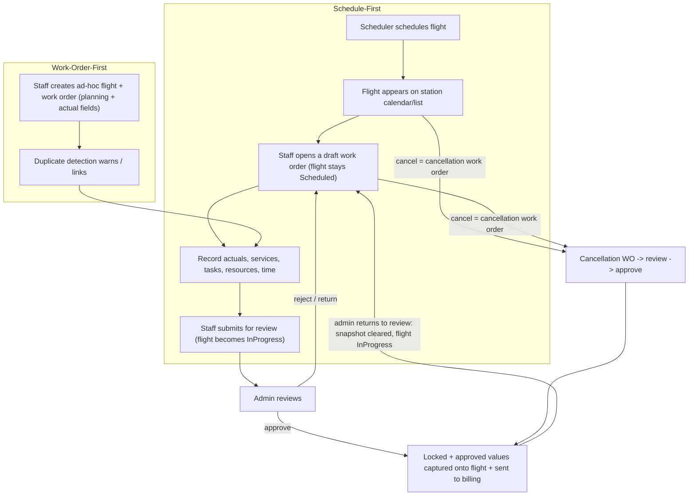
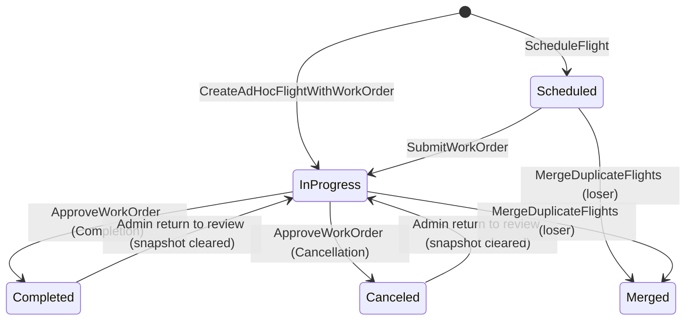

# Operations Module Foundation

Status: **Implemented — living reference (matches the shipped v1.0.0 module)**
Last updated: 2026-07-18

## 1. Purpose And Authority

This document is the living source of truth for the v1.0.0 `Operations` module domain. Future implementation prompts should say: **Follow `docs/modules/operations-foundation.md`.** The companion build plan lives in `docs/modules/operations-module-plan.md`.

The document records three kinds of statements:

- **Decided** — accepted project direction; implementation should follow it.
- **Proposed** — recommended direction awaiting explicit confirmation.
- **Open** — requires further business discussion before implementation.

The legacy Blazor/Radzen project under `legacy/` is a **business reference** for fields, relationships, validation, and workflows. It is **not** an architectural template. Legacy technical debt (many-work-order attachment tables, hard-deletion of superseded records, mobile offline-sync machinery, absence of a workflow timeline) is deliberately removed. Mobile is out of scope for this release but the design must not block it (see §16).

## 2. Business Purpose

The Operations Module manages **customer airline flights and the ground-support operations performed on them** at NAGS stations — from when a flight is first known about (scheduled in advance or walked up unscheduled) until the completed work is reviewed, approved, and handed to billing. It is the operational system of record for **what service was delivered, by whom, with which resources, over what time, and through which lifecycle**.

## 3. Ubiquitous Language

| Term | Meaning |
|---|---|
| **Flight** | The real-world serviced aircraft event (scheduled or ad-hoc). Master record with a lifecycle. |
| **Work Order** | The operational completion/debrief document for a flight. Its outcome is either a normal completion or a cancellation. |
| **Planned Service** | A service expected on the flight (today selected manually; later sourced from the contract). |
| **Performed Service Line** | A service actually delivered, recorded on the work order, tagged `Planned` or `Extra`. |
| **Task** | A Major/Minor work activity with participating staff, tools, materials, general support, a time window, and attachments. |
| **Aircraft Per Landing** | A seeded designation meaning the flight was scheduled with **no intended service** (billed per landing). Not a performable service. Grants station-wide visibility. |
| **On Call** | A derived state: a Per-Landing flight with at least one non-merged work order containing at least one performed service line. It is not a catalog service. |
| **Assigned Employee** | A `StaffMember` assigned to a flight; controls visibility for non-Per-Landing flights. |
| **Cancellation Work Order** | A work order whose outcome records the customer cancelling the flight; still completes the flight and may be billable. |
| **Station Work-Order Number** | Human-facing per-station sequence assigned on approval (`{IATA}-{nnnn}`). |
| **Duplicate / Merge** | Reconciliation of two records that represent the same real flight (ad-hoc) or two work orders on one flight. |

Note: the operational workforce person is **`StaffMember`** (owned by MasterData). There is no `Employee` entity in v1.0.0.

## 4. Actors And Roles

### Decided

- **Scheduler / Ops Planner** — creates and schedules flights from the portal.
- **Station Staff** — completes work orders (in the field / portal), can create ad-hoc flights, and can cancel their own station's flights.
- **Operations Admin / Reviewer** — approves work orders (which locks them and sends them to billing), returns approved work orders to review, cancels/reopens flights, and resolves duplicates/merges.
- **Viewer Only / Executive** — has global, permission-filtered read access to selected portal pages and may receive report-export permissions separately, but cannot mutate operational data.

Viewer Only provides the explicit cross-station read-only oversight account type. Its Role determines which pages are visible; it does not inherit administrative write authority.

## 5. Core Workflows

Supporting workflows: assign/invite employees (an assigned staff member may invite others), claim a Per-Landing flight, record Return-to-Ramp follow-up, auto-generate an empty work order for overdue Per-Landing flights, and merge duplicates. Every lifecycle step is recorded on a portal-visible per-flight timeline.

## 6. Aggregate And Lifecycle Design

### Decided — two aggregates, one coherent lifecycle

The legacy design split `Flight` and `WorkOrder` and then bolted on a many-to-many attachment table, an "accepted work order" snapshot, a `Deleting` sibling status, and a hard-deletion job — most of which existed only to reconcile **mobile** duplicate submissions. That complexity is removed.

- **`Flight`** is the master aggregate root: scheduling data, lifecycle status, assigned employees, planned services, flight-number history, duplicate/merge metadata, and a reference to its current work order.
- **`WorkOrder`** is a separate aggregate root referencing `Flight` by id: actual times, tail number, performed service lines, tasks, submission/approval state, optional signature, and its `WorkOrderType`.

Why two aggregates rather than one large `Flight`:

- The work order carries large, frequently-mutated child graphs (tasks, staff, tools, materials, attachments) edited by field staff, while scheduling data is edited by schedulers. Different actors, different edit rhythms, different contention.
- Keeping them separate keeps each aggregate an appropriately sized consistency boundary.

Why not the legacy many-work-order model:

- With web-only entry plus explicit duplicate detection, we don't need the attachment/sibling-deletion machinery. The "one authoritative completion per flight" invariant is enforced through the `Flight`.

Cross-aggregate consistency (flight status reflecting work-order approval) is coordinated in the application layer within a single transaction (same module, same `DbContext`), each aggregate guarding its own invariants.

### Decided — Flight lifecycle

There is **no `PendingReview` flight status**. Opening/authoring a draft work order does not change the
flight; the flight moves to `InProgress` only when a work order is **submitted**, and it stays
`InProgress` while submissions are under review.

- `Completed` and `Canceled` are **both** terminal, post-approval, billable outcomes reached via an approved work order.
- On approval the flight **captures the approved work order's scalar values plus its reference** (see §6a) and becomes locked.
- `Merged` is a terminal soft-archived state for the losing record of an ad-hoc flight merge.

### Decided — Work Order lifecycle

- `WorkOrderType`: `Completion` | `Cancellation`.
- `Status`: `Draft → Submitted → Approved`; plus `Returned`/`Rejected` (back to editable), and `Superseded` (lost a duplicate merge; soft-archived, linked to survivor).
- **Ownership:** every staff-authored work order carries an owner (`OwnerStaffMemberId` + `StaffMemberSnapshot`), captured at open. Only the owner (or an administrator) can edit or submit it — staff can never touch another employee's work order. System-generated work orders (auto Per-Landing job) have no owner.
- **Multiple work orders:** multiple staff members may each hold their own work order for the same flight while it is `InProgress`; a single staff member holds at most **one active** (Draft/Submitted) work order per flight. The admin decides which one to approve.
- Approval assigns the station work-order number, locks the work order, settles the flight (capturing the approved values), and publishes the billing hand-off event. Only an admin **return to review** unlocks it; returning an approved work order clears its number and the flight's captured snapshot and puts the flight back to `InProgress`.
- Exactly **one `Approved`** work order per flight.

### Decided — Approval requirements

- **Completion:** Actual Aircraft Type, Actual Flight Number, and ATA/ATD are required at approval. Actual service lines and tasks are **optional** (billing later compares planned vs actual); tail number, remarks, and signature are optional.
- **Cancellation:** only the cancellation date/time is required (reason optional). No actuals, aircraft type, services, tasks, or signature are needed.

## 6a. Billing Readiness — Approved Work Order Snapshot On The Flight

### Decided

The **Flight is the billing-ready source of truth**. On work-order approval the flight captures an
`ApprovedWorkOrderSnapshot` (owned value object):

- `ApprovedWorkOrderId` + `ApprovedWorkOrderNumber` (the reference),
- outcome type, actual flight number, actual aircraft type, tail number, ATA/ATD,
- remarks, customer-signature reference, cancellation details (if any), approver + approval time.

The collection-heavy approved data (**actual service lines and tasks**) is *not* copied; it stays on
the locked, immutable approved `WorkOrder`. Any billing hand-off or query therefore loads **both** the
flight snapshot and the referenced approved work order to assemble the full billing view. The
`FlightSentToBilling` integration event carries the ids plus the key approved scalars.

On **return/revert** of an approved work order:

- the work order's number and approval metadata are wiped (a later re-approval draws a **new**
  station-sequence number — numbers are never reused; the retired number stays visible in the timeline),
- the flight's captured snapshot and reference are cleared,
- the flight returns to `InProgress` and the work order becomes editable again for its owner.

## 6b. Flight Timeline / History

### Decided

Every flight has an append-only, portal-visible timeline (`FlightTimelineEntry`, written by
application handlers in the same transaction as the state change): scheduled/ad-hoc created, work
order created/submitted/approved/returned/rejected, flight completed/canceled, employee assigned,
approved-snapshot cleared. Entries record the actor (staff name when resolvable), the work-order
number at the time of the event, and are queryable via
`GET /api/v1/operations/flights/{id}/timeline` and shown on the flight detail page.

## 7. Cancellation

### Decided

Cancellation means **the customer cancelled the flight**. Because the customer may still be billed per contract, cancellation is a **completed operation**, modeled as a **`WorkOrder` with `WorkOrderType = Cancellation`**, not a lightweight flight flag.

- A cancellation work order records who/when and an optional reason, requires the **cancellation time** but **not** ATA/ATD, may have **zero service lines**, flows through **submit → review → approve**, and **receives a station work-order number on approval**.
- On approval the flight becomes `Canceled` (terminal, billable).
- Having both a completion and a cancellation work order (or two completions) for one flight is the **duplicate work orders** scenario (§10).
- **Who can cancel:** station staff (their own station) and admins. **Reopen/return to review:** admins.

## 8. Services, Per-Landing, On Call

### Decided

- **Planned services are mandatory:** a flight cannot be scheduled without at least one planned service. Ad-hoc/work-order-first flights follow the same rule, with a single exception: an ad-hoc flight created together with an explicit **cancellation** work order may carry none.
- **Aircraft Per Landing** is a planning/billing **designation**, not a performable service. A flight whose planned service is Aircraft Per Landing was scheduled **without intended service** and is billed per landing. Such flights are **visible station-wide** and serviceable by any station employee.
- **On Call is derived, not selected:** a Per-Landing flight is On Call when any work order whose status is not `Merged` contains at least one performed service line. No special On Call catalog service exists.
- The qualifying work order may be a Completion or Cancellation work order in any non-merged lifecycle status. Tasks alone and empty work orders do not qualify. Removing the last persisted service line, deleting its work order, or merging that work order away clears On Call unless another qualifying work order remains.
- Opening a Per-Landing work order starts with **zero prefilled service lines**. Staff add only the real services actually performed; adding the first such line makes the flight On Call. Normal flights continue to prefill planned performable services.
- Flight service filters are mutually exclusive: `PerLanding` means the Per-Landing designation without a qualifying work order, `OnCall` means that designation with a qualifying work order, and `Other` means no Per-Landing designation.
- Staff **cannot select Aircraft Per Landing as a performed service line** (excluded from pickers and rejected server-side).
- **Mixing rule (enforced in Operations now):** if a flight's planned services include Aircraft Per Landing, it must be the **only** planned service. This rule lived in the legacy Contracts module; it is enforced in Operations while service selection is manual, and revisited when the Contracts module exists.
- **Planned vs Extra:** each performed service line is tagged `Planned` (from the schedule/contract) or `Extra` (added during the work) so future billing can treat them differently.

### Work-order content

- **Actual service lines and tasks are optional** — a completion may be submitted and approved with zero actual services. Billing later compares planned vs actual; the work order is not forced to include the planned services.
- Completion approval requires the actual aircraft type, actual flight number, and ATA/ATD (see §6).

## 9. Assignment And Visibility

### Decided

- Crew assignment at scheduling is **optional**; employees can be assigned later.
- **Non-Per-Landing** flights are visible only to their **assigned employees** (plus schedulers/admins).
- **Per-Landing** flights are visible **station-wide**; any station employee can claim/serve them.
- **Station scoping:** Station Staff see only their own station's flights; Schedulers and Admins see all stations. Viewer Only accounts have global read scope but retain no write scope. Fail closed if a Station Staff caller's linked StaffMember or station is inactive.
- **Backend-enforced on reads AND writes:** visibility is enforced server-side (`OperationsScopeContext.EnsureFlightAccess`) across flight list/calendar/detail/timeline queries, work-order detail and review-queue queries, and every authoring path — never only in the UI.
- **Assigned staff can invite:** an already-assigned staff member may assign/invite other employees onto the flight; admins/schedulers are unrestricted.

## 10. Duplicate Detection And Merge

### Decided

Two scenarios, handled differently:

1. **Duplicate ad-hoc flights** — probabilistic detection. A `FlightDuplicateDetector` scores candidates using **customer + station + scheduled/actual-time proximity** as the primary signals, with normalized flight number, tail number, and aircraft type as supporting signals. Candidates are found via a cheap scoped query (same station, same day, time window). UX: **warn** the creator with ranked candidates and let them **proceed** or **link to the existing flight**; if they proceed despite a strong match, the pair is **flagged for admin review**.
2. **Duplicate work orders for one flight** — **deterministic**, no scoring: any flight holding more than one **active** work order (`Draft`/`Submitted`/`Approved`), including completion-vs-cancellation, is surfaced in the review queue for resolution.

### Decided — merge resolution

- Admin resolves via an **IDE-style merge-conflict UI**, choosing values **field-by-field**.
- The **surviving record is updated in place**; losers are **soft-archived, never hard-deleted**:
  - Work orders → `Superseded`, with `SupersededByWorkOrderId` and a `WorkOrderMergeResolution` record (resolvedBy, resolvedAt, source/target ids, per-field choices, optional reason).
  - Flights → `Merged`, with `MergedIntoFlightId` and a `FlightMergeResolution` record; the loser's work order is re-pointed to the survivor (which may then trigger a work-order merge).
- Archived records are hidden from normal lists, retained for audit, and excluded from future duplicate scoring.
- Invariant preserved: exactly one `Approved` work order per flight.

## 11. Flight Number Changes

### Decided

A flight number may change after scheduling. Store **both** `OriginalFlightNumber` (set once at creation) and `FlightNumber` (current), both **normalized and independently searchable**. A `ChangeFlightNumber` command updates current, preserves original, and raises `FlightNumberChanged` for the history timeline.

## 12. Auto-Generation For Overdue Per-Landing Flights

### Decided

A background job creates an **empty work order** (placed into the review queue) for Per-Landing flights that are still `Scheduled` past **STD + 60 minutes** (default, configurable in appsettings), so they do not remain open forever. The job does **not** auto-approve or auto-close; an admin still reviews and approves. Per-station override of the timeout is an Open item.

## 13. Domain Model

### Aggregate roots

- **`Flight`** — root.
- **`WorkOrder`** — root (references `Flight` by id).
- **`StationWorkOrderSequence`** — small root for concurrency-safe per-station numbering.

### Entities

- Within `Flight`: `FlightAssignedEmployee`, `PlannedService`.
- Within `WorkOrder`: `WorkOrderServiceLine`, `WorkOrderServiceLinePerformer`, `WorkOrderTask`, `WorkOrderTaskEmployee`, `WorkOrderTaskTool`, `WorkOrderTaskMaterial`, `WorkOrderTaskGeneralSupport`, `WorkOrderTaskAttachment`.
- Standalone (append-only): `FlightTimelineEntry` — the per-flight portal-visible history (§6b).

Service lines and task lines **both support multiple employees**.

### Value objects

`FlightNumber` (normalized current), `OriginalFlightNumber`, `ScheduledTime` (STA/STD, STD ≥ STA), `ActualTime` (ATA/ATD, ATD ≥ ATA), `TimeWindow` (From/To), `WorkOrderNumber` (`{IATA}-{nnnn}`), `Quantity`, `CancellationDetails` (canceledBy/at/reason), `ApprovedWorkOrderSnapshot` (the captured approved work-order scalars + reference on the flight, §6a), `WorkOrderMergeResolution`, `FlightMergeResolution`, and immutable MasterData snapshots: `CustomerSnapshot`, `StationSnapshot`, `OperationTypeSnapshot`, `AircraftTypeSnapshot`, `ServiceSnapshot`, `StaffMemberSnapshot`, `ToolSnapshot`, `MaterialSnapshot`, `GeneralSupportSnapshot`.

### Domain services

- `FlightDuplicateDetector` — probabilistic same-flight scoring.
- `PerLandingPolicy` — enforces the single-service constraint and picker exclusions.
- `WorkOrderNumberGenerator` — per-station sequence allocation.
- `AutoWorkOrderPolicy` — eligibility + empty work-order creation for overdue Per-Landing flights.

### Domain events

`FlightScheduled`, `AdHocFlightCreated`, `FlightNumberChanged`, `EmployeeAssignedToFlight`, `WorkOrderOpened`, `WorkOrderSubmitted`, `WorkOrderApproved`, `WorkOrderReturnedToReview`, `WorkOrderRejected`, `WorkOrderSuperseded`, `FlightCompleted`, `FlightCanceled`, `FlightMerged`, `ApprovedWorkOrderSnapshotCleared`, `FlightSentToBilling` (integration).

## 14. Statuses Summary

- **Flight.Status:** `Scheduled`, `InProgress`, `Completed`, `Canceled`, `Merged`. (There is no `PendingReview` flight status; submitted work orders leave the flight `InProgress`.)
- **WorkOrder.Status:** `Draft`, `Submitted`, `Approved`, `Returned`, `Rejected`, `Superseded`.
- **WorkOrder.Type:** `Completion`, `Cancellation`.

## 15. Use Cases

### Commands

`ScheduleFlight`, `BatchScheduleFlights`, `UpdateScheduledFlight`, `ChangeFlightNumber`, `AssignEmployees`, `InviteEmployee`, `RemoveAssignment`, `CreateAdHocFlightWithWorkOrder`, `OpenWorkOrder`, `UpdateWorkOrder`, `RecordReturnToRamp`, `SubmitWorkOrder`, `WithdrawWorkOrder`, `ApproveWorkOrder` (locks + billing event), `ReturnWorkOrderToReview`, `RejectWorkOrder`, `CancelFlight` (creates cancellation work order), `ReopenFlight`, `ClaimPerLandingFlight`, `MergeDuplicateFlights`, `MergeDuplicateWorkOrders`.

### Queries / screens / reports

- Scheduler calendar (period, station- and assignment-scoped; portal page at `/operations/calendar` shows scheduled and ad-hoc flights).
- Flights list (paged; filters: status/station/customer/date; scope- and assignment-aware).
- Flight export (Excel/PDF/CSV; requires both `operations.flights.view` and the separately granted
  `operations.flights.export`; `Completed`/`Canceled` rows use the approved work order,
  `InProgress` rows use the newest submitted or returned work order, and `Scheduled` rows keep
  work-order columns empty).
- Flight detail (schedule, crew, planned services, work orders with owners, captured approved work-order values, lifecycle timeline).
- Flight timeline (`GET /flights/{id}/timeline`).
- Work order review/detail (services, tasks, resources, actuals, owner, signature) — access-scoped.
- Review queue (submitted work orders) — access-scoped for station staff.
- Duplicate candidates + merge-conflict resolution screen.
- Operations dashboard / KPIs. Viewing analytics requires `operations.dashboard.view-analytics`;
  downloading its Excel/PDF/CSV flight report additionally requires
  `operations.dashboard.export`.

## 16. Dependencies

### Identity (Decided)

Reference `Identity.Contracts` for integration events only — never `Identity.Domain/Application/Infrastructure`. Use `IUserContext` (`UserId`, `UserType`, `ExternalReferenceId` = StaffMember id, `HasPermission`). Define an `operations.*` permission catalog (`IPermissionCatalog`) and an `IOperationsScope` mirroring `MasterDataScope`.

### MasterData (Decided + Open)

Validate and **snapshot** Customer, Station, OperationType, AircraftType, Service, StaffMember, Tool, Material, GeneralSupport by id, and use `WellKnownMasterDataIds.AircraftPerLandingService` and `AdHocOperationType`. On Call is calculated from Operations work orders and has no MasterData id.

**Open — cross-module read seam.** MasterData exposes no reader contracts or read snapshots yet. Operations needs a validated read seam (reader interfaces in `MasterData.Contracts`, or internal query handlers) to validate ids and build snapshots. This must be built as part of Operations' foundation.

### Future — Contracts and Billing

- **Contracts (later):** flight creation validates an active contract (customer/station/operation-type/time); planned services come from the contract; the Per-Landing mixing rule moves back to contract definition. Seams now: nullable `ContractId`/`ContractNumber` on `Flight` and a pluggable planned-service source.
- **Billing (later):** consumes the `FlightSentToBilling` / `WorkOrderApproved` integration event (published as a stub now). Planned/Extra tags and time windows are the billing inputs.

### Mobile readiness (Decided — design only, do not build)

Keep the design mobile-ready: API-first `/api/v1/operations/...`, self-contained work-order authoring commands, snapshot value objects, and a **reserved optional client-idempotency seam** (`clientFlightId`/`clientMutationId` on create/update commands) so offline sync can be added later without reshaping the domain. No SignalR/sync/mobile endpoints in this release.

## 17. Persistence Conventions

- Own EF Core schema **`operations`** with outbox/inbox tables (same pattern as MasterData).
- `Guid` PKs; no strongly-typed ID wrappers (matches current codebase).
- MasterData-owned data captured as **owned snapshot value objects**, not live FKs.
- `RowVersion` + ETag/`If-Match` on editable records (409 on conflict). Business numbers via the explicit per-station sequence (exception to optimistic concurrency).
- `DateTimeOffset` stored/exchanged in UTC; rendered in the operation/user time zone at the edges.

## 18. Attachment Policy

### Decided (defaults, configurable in appsettings)

- Images (`jpg`/`jpeg`/`png`/`webp`): ≤ 5 MB each.
- Voice (`mp3`/`m4a`/`ogg`/`wav`): ≤ 10 MB each.
- Documents (`pdf`/`doc`/`docx`/`xls`/`xlsx`): ≤ 10 MB each.
- Per work order: ≤ 20 attachments and ≤ 50 MB total.
- Stored via BuildingBlocks file storage; content type validated against the allow-list.

## 19. Resolved Decisions (formerly open)

All previously open questions are now decided; there are no blocking open items.

1. **Cancellation after a completion is approved** — cancellation is handled **exactly like work-order creation**. A cancellation work order can always be created, even after a completion work order is approved; this simply becomes the **duplicate work orders** scenario resolved by the admin (return the approved one to review and/or merge/supersede).
2. **Approval outcome and the single-approved invariant** — an approved `Completion` work order sets the flight to `Completed`; an approved `Cancellation` work order sets it to `Canceled`. **Exactly one `Approved` work order per flight**; to approve a competing/cancellation work order while one is already approved, the admin first **returns the approved work order to review** (unlock) or resolves the duplicate, then approves the intended one.
3. **Auto-generation timeout** — a **single global value in appsettings** (default 60 min); no per-station override.
4. **Contracts** — **ignored for now**. Planned services remain **manual selection**. A later iteration may query/validate services from contracts; keep only the nullable `ContractId`/`ContractNumber` seam, with no contract logic in this release.
5. **On Call** — a derived Per-Landing flight state, not a service or billing line. Billing uses the real performed service lines that caused the state.

## 20. Decisions Log

- 2026-07-03 — Two aggregates (`Flight` + `WorkOrder`) with one coherent lifecycle; legacy many-work-order attachment model dropped.
- 2026-07-03 — Cancellation modeled as a `WorkOrder` (`Cancellation` type) that completes and numbers the flight; not a lightweight flag.
- 2026-07-03 — Aircraft Per Landing = "no intended service" designation with station-wide visibility; Per-Landing cannot mix with other planned services (enforced in Operations for now). The original add-on-service interpretation of On Call was superseded on 2026-07-18.
- 2026-07-03 — Performed service lines tagged Planned/Extra; planned services auto-copied on work-order open.
- 2026-07-03 — Service lines and task lines both support multiple employees.
- 2026-07-03 — Duplicate ad-hoc flights via scoring; duplicate work orders deterministic; merge updates survivor in place and soft-archives losers (`Superseded`/`Merged`) with recorded resolutions — never hard-deleted.
- 2026-07-03 — Original + current flight number both preserved and searchable.
- 2026-07-03 — Auto-generate empty work order for overdue Per-Landing flights at STD + 60 min (configurable); no auto-approve.
- 2026-07-03 — Mobile deferred but design kept mobile-ready with reserved client-idempotency seam.
- 2026-07-03 — Cancellation handled like work-order creation; a cancellation after an approved completion is a duplicate resolved by admin; exactly one approved work order per flight.
- 2026-07-03 — Auto-generation timeout is a single global appsettings value (no per-station override).
- 2026-07-03 — Contracts ignored this release; planned services stay manual selection; only nullable contract seam retained.
- 2026-07-04 — `PendingReview` flight status removed. Opening a draft work order does not change the flight; the flight moves `Scheduled → InProgress` only on work-order submit and stays `InProgress` until approval.
- 2026-07-04 — The Flight is the billing-ready source of truth: approval captures an `ApprovedWorkOrderSnapshot` (scalars + `ApprovedWorkOrderId`/`ApprovedWorkOrderNumber` reference) onto the flight; actual service lines/tasks are read from the locked approved work order. Return/revert clears the snapshot, wipes the work-order number, and reverts the flight to `InProgress`; re-approval draws a new number (never reused).
- 2026-07-04 — Work orders are owner-scoped by StaffMember (`OwnerStaffMemberId` + snapshot). Only the owner (or an admin) edits/submits; multiple staff may each hold their own work order per flight, one active per staff member per flight.
- 2026-07-04 — Completion approval requires actual aircraft type, actual flight number, and ATA/ATD. Actual services/tasks are optional at submission and approval (the "must include all planned services" submit rule is removed); billing later compares planned vs actual.
- 2026-07-04 — Scheduling requires at least one planned service; ad-hoc/work-order-first creation follows the same rule except for explicit cancellations.
- 2026-07-04 — Visibility is enforced server-side on reads and writes: per-landing flights are station-wide; non-per-landing flights are assigned-staff-only (plus admins). Assigned staff may invite others.
- 2026-07-04 — Per-flight append-only timeline (`FlightTimelineEntry`) written in-transaction by handlers, exposed at `GET /flights/{id}/timeline`, and shown on the flight detail page.
- 2026-07-04 — Work-order-first portal flow collects flight planning fields AND work-order actual fields in one dialog; the created flight appears on the calendar and list immediately. Portal calendar page added at `/operations/calendar`.
- 2026-07-18 — Retired the seeded On Call service. On Call is now derived for a Per-Landing flight from any non-merged work order with at least one performed service line; Per-Landing work orders start empty and staff record only services actually performed.
- 2026-07-20 — Performed service lines now persist and expose multiple employees, matching task employee selection across the portal and mobile app. Flight exports keep their existing columns and formatting while sourcing work-order values for `InProgress` rows from the latest submitted/returned work order; `Scheduled` rows remain empty.
- 2026-07-24 — Viewer Only provides global, permission-filtered read access for executive oversight. Operations Dashboard and Flights report downloads require explicit export permissions in addition to their page-view permissions.
